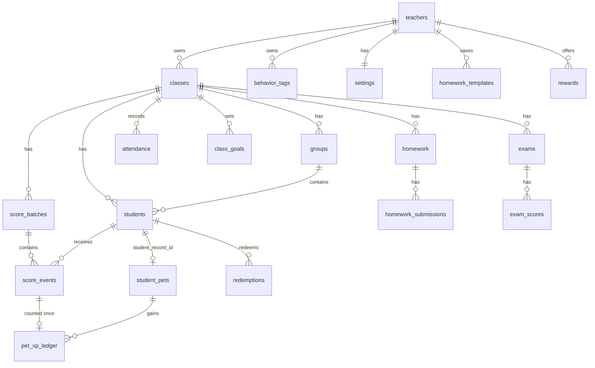

# 資料庫設計

SQLite／Turso libSQL（`server/schema.js`），第一次運行時自動建立及升級。所有業務表都有 `teacher_id`，API 每次查詢都以登入老師的 id 篩選。

| 表 | 用途 | 重點欄位／約束 |
|---|---|---|
| `teachers` | 老師帳戶 | `email` UNIQUE；`password_hash` = scrypt（任何 API 都不會傳回）；`is_admin`；`last_login_at`／`last_seen_at`（管理員可見） |
| `login_attempts` | 登入失敗紀錄 | 15 分鐘內同一電郵＋IP 最多 10 次 |
| `sessions` | 登入工作階段 | 只存 token 的 SHA-256；30 日到期 |
| `settings` | 每位老師的設定 | `thresholds` JSON：`{baby, junior, adult, evolved}`；`timer_presets`；`hunger_days`（幾多個上課日冇加分寵物會肚餓，0 = 關閉；最後餵食時間由 `pet_xp_ledger` 即時計出） |
| `classes` | 班別 | `name`、`school_year`、`seat_cols`（座位表每行座位數） |
| `groups` | 小組 | `color` |
| `students` | 學生 | `number`（班號）、`group_id`、`seat_row`／`seat_col`（座位，NULL＝未編位，自動按班號補位）、`score`（總分快取，＝未撤銷 `score_events.delta` 總和） |
| `behavior_tags` | 行為標籤 | `points`（-20 至 20）、`icon` |
| `score_batches` | 一次加減分操作 | `UNIQUE(teacher_id, client_batch_id)` 防重複提交；`undone_at` |
| `score_events` | 每位學生每筆分數 | `kind` = `point`（課堂）或 `import`（保留舊分數）；`id` 單調遞增 |
| `student_pets` | **StudentPet，寵物唯一資料來源** | `student_record_id` UNIQUE → `students.id`；`species_key`、`stage` 有 CHECK；`xp ≥ 0`；`baseline_event_id`；`nickname`；`accessories` JSON |
| `pet_xp_ledger` | XP 入帳 | `score_event_id` 為主鍵（同一筆加分只可入帳一次）；`stage_before`／`stage_after`；`reversed_at`（撤銷） |
| `homework` / `homework_submissions` | 功課及提交 | 狀態：`submitted` 已交、`late` 遲交、`missing` 欠交、`excused` 豁免 |
| `homework_templates` | 常用功課範本（老師本人，所有班別共用） | `UNIQUE(teacher_id, title, subject)`；新老師預設 4 個 |
| `attendance` | 點名（只記缺席） | `PRIMARY KEY(student_id, date)`；date 為老師裝置的香港日期 |
| `class_goals` | 全班合作目標 | `target`；`baseline_event_id`（只計之後未撤銷的正向課堂加分）；`ended_at` |
| `rewards` / `redemptions` | 獎勵及兌換 | 可用分數 ＝ 總分 − 未撤銷兌換總和；總分及寵物 XP 不受影響；`undone_at` |
| `exams` / `exam_scores` | 考試成績 | `full_mark`；分數範圍 0 至滿分 |

## 不變條件（`GET /api/audit` 逐項檢查）

1. `student_pets.xp` ＝ 該寵物未撤銷 `pet_xp_ledger.xp` 總和。
2. 每筆入帳對應的 `score_events`：同一學生、`kind='point'`、`delta>0`、`id > baseline_event_id`、XP ＝ delta。
3. `stage` 不低於 `stageForXp(xp, thresholds)`（只會前進）。
4. `students.score` ＝ 該學生未撤銷 `score_events.delta` 總和。
